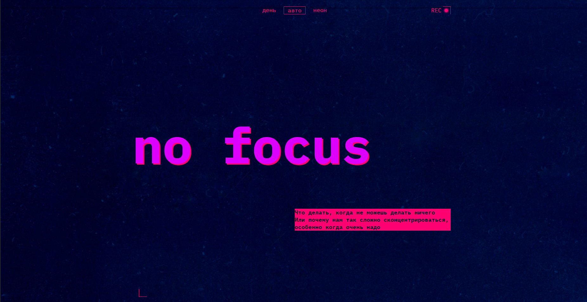

https://github.com/AlanWakeKing/slozhno-sosredotochitsya.git

<h2>Яндекс.Практика. Практическая работа "Сложно сосредоточится"</h2>

<h2 aling="center">Оглавление</h2>

- [Скриншот](#скриншот)
- [Описание](#описание)
- [Автор](#автор)

<h2 aling="center">Скриншот</h2>

<h2 aling="center"> Описание</h2>

Блог, выполненный с адаптивной вёрсткой под мобильный экран, планшет и десктоп. Так же на данном сайте присутствует переключение темы на "темную", "светлую" и авто, по усмотрению пользователя.

<h2 aling="center">Автор</h2>

- Github - [AlanWakeKing](https://github.com/AlanWakeKing)